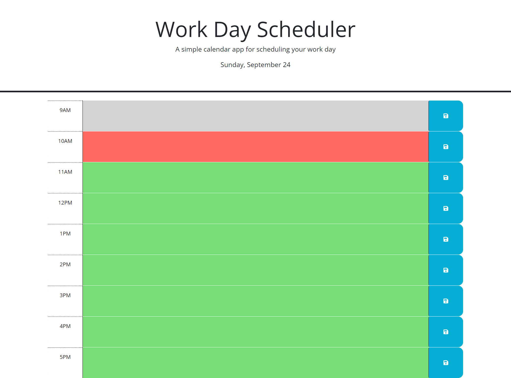

# Work-Day-Scheduler

## Description
This site is designed to keep track of your daily work schedule.

It features a common 9AM - 5PM time block and a display of the current date. Each time block is colored to determine whether the hour has passed,
come, or will be. Gray for past hours, red for the present hour, and green for future hours. Each time block also features a save button, so when
the user closes the webpage, any information inputted will be saved in the local storage, and will be there when the user opens back up the webpage.

## Screenshot

## Deployed Link

https://cazthetraveler.github.io/Work-Day-Scheduler/